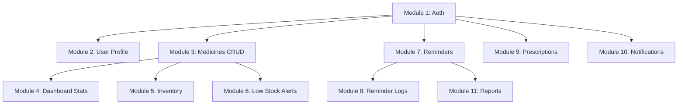
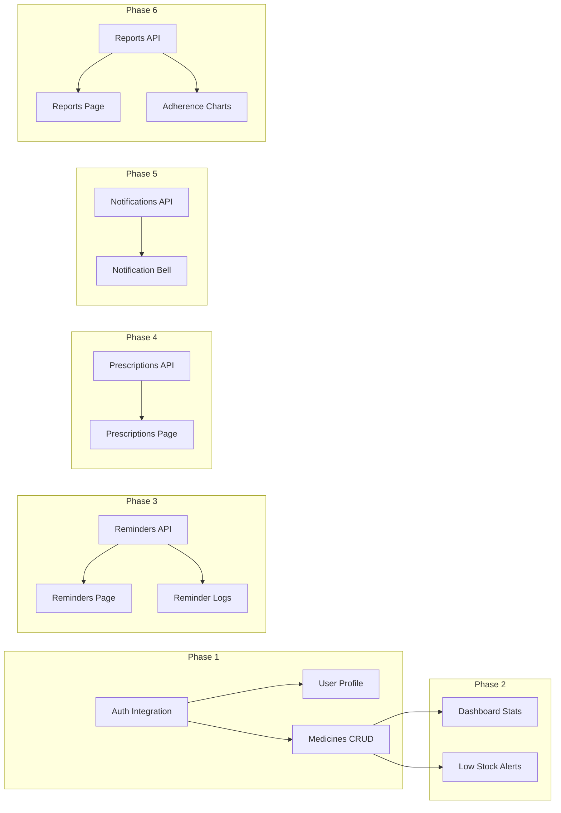

# Frontend-Backend Integration Plan

## Executive Summary

This document outlines a module-by-module integration plan for connecting the Pillio Health Hub frontend (React/Vite) with the backend (FastAPI). The backend has ready APIs for **Auth**, **Users**, and **Medicines**, while the frontend currently uses mock data. Missing backend APIs need to be created for **Reminders**, **Prescriptions**, **Notifications**, and **Reports**.

---

## Current State Analysis

### Backend APIs (Ready)

| Module | Base Path | Status | Endpoints |
|--------|-----------|--------|-----------|
| **Auth** | `/api/v1/auth` | ✅ Ready | `POST /register`, `POST /login`, `POST /refresh`, `POST /logout`, `GET /me`, `PUT /me`, `POST /change-password`, `POST /forgot-password`, `POST /reset-password` |
| **Users** | `/api/v1/users` | ✅ Ready | `GET /profile`, `PUT /profile`, `DELETE /account`, `GET /stats` |
| **Medicines** | `/api/v1/medicines` | ✅ Ready | `POST /`, `GET /`, `GET /search`, `GET /low-stock`, `GET /by-form/{form}`, `GET /statistics`, `GET /{id}`, `PUT /{id}`, `DELETE /{id}`, `POST /{id}/adjust-stock`, `GET /{id}/history` |

### Backend APIs (Needed)

| Module | Base Path | Status | Endpoints |
|--------|-----------|--------|-----------|
| **Reminders** | `/api/v1/reminders` | ❌ Missing | `POST /`, `GET /`, `GET /{id}`, `PUT /{id}`, `DELETE /{id}`, `POST /{id}/take`, `POST /{id}/skip` |
| **Prescriptions** | `/api/v1/prescriptions` | ❌ Missing | `POST /`, `GET /`, `GET /{id}`, `PUT /{id}`, `DELETE /{id}`, `POST /{id}/upload` |
| **Notifications** | `/api/v1/notifications` | ❌ Missing | `GET /`, `PUT /{id}/read`, `DELETE /{id}` |
| **Reports** | `/api/v1/reports` | ❌ Missing | `GET /adherence`, `GET /consumption` |

### Frontend Status

| Page/Component | Mock Data | API Integration Needed |
|----------------|-----------|------------------------|
| `AuthContext` | ✅ Yes | Replace with real API calls |
| `DashboardPage` | ✅ Yes | Connect to `/users/stats` |
| `MedicinesPage` | ✅ Yes | Connect to `/medicines` |
| `RemindersPage` | ✅ Yes | Create API + connect |
| `PrescriptionsPage` | ✅ Yes | Create API + connect |
| `InventoryPage` | ✅ Yes | Connect to `/medicines` |
| `HistoryPage` | ✅ Yes | Create API + connect |
| `ReportsPage` | ✅ Yes | Create API + connect |
| `SettingsPage` | ✅ Yes | Connect to `/users/profile` |

---

## Integration Order



---

## Module-by-Module Integration Plan

### Module 1: Authentication Integration

**Backend Status:** ✅ Ready  
**Frontend Status:** ⚠️ Mock Data

**Tasks:**
1. Update [`AuthContext.tsx`](src/contexts/AuthContext.tsx) to use real API
2. Replace mock login with `POST /api/v1/auth/login`
3. Replace mock register with `POST /api/v1/auth/register`
4. Implement token storage and refresh logic
5. Update `/auth/me` endpoint call for profile validation
6. Handle error responses from backend

**Frontend Files to Modify:**
- [`src/contexts/AuthContext.tsx`](src/contexts/AuthContext.tsx)
- [`src/pages/auth/LoginPage.tsx`](src/pages/auth/LoginPage.tsx)
- [`src/pages/auth/RegisterPage.tsx`](src/pages/auth/RegisterPage.tsx)

**API Mapping:**
| Frontend Action | Backend Endpoint |
|-----------------|------------------|
| Login | `POST /api/v1/auth/login` |
| Register | `POST /api/v1/auth/register` |
| Get Profile | `GET /api/v1/auth/me` |
| Update Profile | `PUT /api/v1/auth/me` |
| Change Password | `POST /api/v1/auth/change-password` |
| Forgot Password | `POST /api/v1/auth/forgot-password` |
| Reset Password | `POST /api/v1/auth/reset-password` |
| Refresh Token | `POST /api/v1/auth/refresh` |
| Logout | `POST /api/v1/auth/logout` |

---

### Module 2: Medicines CRUD Integration

**Backend Status:** ✅ Ready  
**Frontend Status:** ⚠️ Mock Data

**Tasks:**
1. Create API service module for medicines
2. Update [`MedicinesPage.tsx`](src/pages/MedicinesPage.tsx) to fetch from API
3. Implement search and filter functionality
4. Create medicine form dialog for add/edit
5. Connect stock adjustment to `POST /{id}/adjust-stock`
6. Add loading states and error handling

**Frontend Files to Create:**
- [`src/lib/medicines-api.ts`](src/lib/medicines-api.ts)

**Frontend Files to Modify:**
- [`src/pages/MedicinesPage.tsx`](src/pages/MedicinesPage.tsx)
- [`src/components/inventory/LowStockAlert.tsx`](src/components/inventory/LowStockAlert.tsx)

**API Mapping:**
| Frontend Action | Backend Endpoint |
|-----------------|------------------|
| List Medicines | `GET /api/v1/medicines` |
| Get Medicine | `GET /api/v1/medicines/{id}` |
| Create Medicine | `POST /api/v1/medicines` |
| Update Medicine | `PUT /api/v1/medicines/{id}` |
| Delete Medicine | `DELETE /api/v1/medicines/{id}` |
| Search Medicines | `GET /api/v1/medicines/search?q=` |
| Get Low Stock | `GET /api/v1/medicines/low-stock` |
| Adjust Stock | `POST /api/v1/medicines/{id}/adjust-stock` |
| Get History | `GET /api/v1/medicines/{id}/history` |
| Get Statistics | `GET /api/v1/medicines/statistics` |

---

### Module 3: Dashboard Stats Integration

**Backend Status:** ✅ Ready (`/users/stats`)  
**Frontend Status:** ⚠️ Mock Data

**Tasks:**
1. Connect [`DashboardStats.tsx`](src/components/dashboard/DashboardStats.tsx) to `GET /api/v1/users/stats`
2. Update [`DashboardPage.tsx`](src/pages/DashboardPage.tsx) to fetch user-specific data
3. Add real-time stats updates on actions

**Frontend Files to Modify:**
- [`src/components/dashboard/DashboardStats.tsx`](src/components/dashboard/DashboardStats.tsx)
- [`src/pages/DashboardPage.tsx`](src/pages/DashboardPage.tsx)

---

### Module 4: Reminders API & Integration

**Backend Status:** ❌ Missing - Need to create  
**Frontend Status:** ⚠️ Mock Data

**Backend Tasks:**
1. Create [`app/api/reminders.py`](pillio-backend/app/api/reminders.py)
2. Create [`app/services/reminder_service.py`](pillio-backend/app/services/reminder_service.py)
3. Add reminder routes to [`app/main.py`](pillio-backend/app/main.py)

**Backend Endpoints to Create:**
| Method | Endpoint | Description |
|--------|----------|-------------|
| `POST` | `/api/v1/reminders` | Create reminder |
| `GET` | `/api/v1/reminders` | List reminders |
| `GET` | `/api/v1/reminders/{id}` | Get reminder |
| `PUT` | `/api/v1/reminders/{id}` | Update reminder |
| `DELETE` | `/api/v1/reminders/{id}` | Delete reminder |
| `POST` | `/api/v1/reminders/{id}/take` | Mark as taken |
| `POST` | `/api/v1/reminders/{id}/skip` | Skip reminder |

**Frontend Tasks:**
1. Create [`src/lib/reminders-api.ts`](src/lib/reminders-api.ts)
2. Update [`RemindersPage.tsx`](src/pages/RemindersPage.tsx)
3. Update [`UpcomingReminders.tsx`](src/components/dashboard/UpcomingReminders.tsx)

---

### Module 5: Reminder Logs Integration

**Backend Status:** ✅ Model exists (needs API)  
**Frontend Status:** ❌ Missing

**Backend Tasks:**
1. Create reminder logs API in [`app/api/reminders.py`](pillio-backend/app/api/reminders.py)
2. Add endpoints for log history

**Frontend Tasks:**
1. Update reminder components to track taken/skipped/missed
2. Create adherence tracking visualization

---

### Module 6: Prescriptions API & Integration

**Backend Status:** ❌ Missing - Need to create  
**Frontend Status:** ⚠️ Mock Data

**Backend Tasks:**
1. Create [`app/api/prescriptions.py`](pillio-backend/app/api/prescriptions.py)
2. Create [`app/services/prescription_service.py`](pillio-backend/app/services/prescription_service.py)
3. Add prescription routes to [`app/main.py`](pillio-backend/app/main.py)

**Backend Endpoints to Create:**
| Method | Endpoint | Description |
|--------|----------|-------------|
| `POST` | `/api/v1/prescriptions` | Create prescription |
| `GET` | `/api/v1/prescriptions` | List prescriptions |
| `GET` | `/api/v1/prescriptions/{id}` | Get prescription |
| `PUT` | `/api/v1/prescriptions/{id}` | Update prescription |
| `DELETE` | `/api/v1/prescriptions/{id}` | Delete prescription |
| `POST` | `/api/v1/prescriptions/{id}/upload` | Upload prescription image |

**Frontend Tasks:**
1. Create [`src/lib/prescriptions-api.ts`](src/lib/prescriptions-api.ts)
2. Update [`PrescriptionsPage.tsx`](src/pages/PrescriptionsPage.tsx)
3. Create prescription upload component

---

### Module 7: Notifications API & Integration

**Backend Status:** ❌ Missing - Need to create  
**Frontend Status:** ❌ Missing

**Backend Tasks:**
1. Create [`app/api/notifications.py`](pillio-backend/app/api/notifications.py)
2. Create notification service
3. Add notification routes to [`app/main.py`](pillio-backend/app/main.py)

**Backend Endpoints to Create:**
| Method | Endpoint | Description |
|--------|----------|-------------|
| `GET` | `/api/v1/notifications` | List notifications |
| `GET` | `/api/v1/notifications/unread` | Get unread count |
| `PUT` | `/api/v1/notifications/{id}/read` | Mark as read |
| `PUT` | `/api/v1/notifications/read-all` | Mark all as read |
| `DELETE` | `/api/v1/notifications/{id}` | Delete notification |

**Frontend Tasks:**
1. Update [`NotificationContext.tsx`](src/contexts/NotificationContext.tsx)
2. Update [`NotificationBell.tsx`](src/components/notifications/NotificationBell.tsx)
3. Create notification dropdown component

---

### Module 8: Reports & Analytics API

**Backend Status:** ❌ Missing - Need to create  
**Frontend Status:** ⚠️ Mock Data

**Backend Tasks:**
1. Create [`app/api/reports.py`](pillio-backend/app/api/reports.py)
2. Add report routes to [`app/main.py`](pillio-backend/app/main.py)

**Backend Endpoints to Create:**
| Method | Endpoint | Description |
|--------|----------|-------------|
| `GET` | `/api/v1/reports/adherence` | Get adherence report |
| `GET` | `/api/v1/reports/consumption` | Get consumption report |
| `GET` | `/api/v1/reports/inventory` | Get inventory report |
| `GET` | `/api/v1/reports/summary` | Get summary report |

**Frontend Tasks:**
1. Create [`src/lib/reports-api.ts`](src/lib/reports-api.ts)
2. Update [`ReportsPage.tsx`](src/pages/ReportsPage.tsx)
3. Update [`AdherenceChart.tsx`](src/components/analytics/AdherenceChart.tsx)

---

### Module 9: Settings & Profile Integration

**Backend Status:** ✅ Ready  
**Frontend Status:** ⚠️ Mock Data

**Tasks:**
1. Update [`SettingsPage.tsx`](src/pages/SettingsPage.tsx) to use `GET /api/v1/users/profile`
2. Connect profile update to `PUT /api/v1/users/profile`
3. Implement account deletion flow

---

## Implementation Sequence



---

## API Service Module Pattern

Create standardized API service modules following the pattern in [`api.ts`](src/lib/api.ts):

```typescript
// Example: src/lib/medicines-api.ts
import api from './api';

export const medicinesApi = {
  list: (params?: MedicineListParams) => 
    api.get<PaginatedResponse<Medicine>>('/medicines', params),
    
  get: (id: string) => 
    api.get<Medicine>(`/medicines/${id}`),
    
  create: (data: CreateMedicineDTO) => 
    api.post<Medicine>('/medicines', data),
    
  update: (id: string, data: UpdateMedicineDTO) => 
    api.put<Medicine>(`/medicines/${id}`, data),
    
  delete: (id: string) => 
    api.delete<void>(`/medicines/${id}`),
    
  adjustStock: (id: string, adjustment: number, reason: string) =>
    api.post<Medicine>(`/medicines/${id}/adjust-stock`, { adjustment, reason }),
    
  getHistory: (id: string) =>
    api.get<InventoryHistory[]>(`/medicines/${id}/history`),
};
```

---

## Error Handling Strategy

1. **Global Error Handler:** Update [`api.ts`](src/lib/api.ts) to handle 401, 403, 404, 500 errors
2. **Auth Token Refresh:** Implement automatic token refresh on 401 responses
3. **Loading States:** Add loading states to all components
4. **Toast Notifications:** Use existing toast system for error messages

---

## Testing Integration

1. **Backend Tests:** Verify API endpoints work with test data
2. **Frontend Integration Tests:** Test API calls with mock backend
3. **E2E Tests:** Test complete user flows after integration

---

## Files to Create/Modify Summary

### New Files to Create

| File Path | Description |
|-----------|-------------|
| `src/lib/medicines-api.ts` | Medicine API service |
| `src/lib/reminders-api.ts` | Reminder API service |
| `src/lib/prescriptions-api.ts` | Prescription API service |
| `src/lib/notifications-api.ts` | Notification API service |
| `src/lib/reports-api.ts` | Reports API service |
| `pillio-backend/app/api/reminders.py` | Backend reminders router |
| `pillio-backend/app/api/prescriptions.py` | Backend prescriptions router |
| `pillio-backend/app/api/notifications.py` | Backend notifications router |
| `pillio-backend/app/api/reports.py` | Backend reports router |
| `pillio-backend/app/services/reminder_service.py` | Reminder business logic |
| `pillio-backend/app/services/prescription_service.py` | Prescription business logic |

### Files to Modify

| File Path | Changes |
|-----------|---------|
| `src/contexts/AuthContext.tsx` | Replace mock with real API |
| `src/pages/auth/LoginPage.tsx` | Connect to real API |
| `src/pages/auth/RegisterPage.tsx` | Connect to real API |
| `src/pages/MedicinesPage.tsx` | Connect to medicines API |
| `src/pages/RemindersPage.tsx` | Connect to reminders API |
| `src/pages/PrescriptionsPage.tsx` | Connect to prescriptions API |
| `src/pages/ReportsPage.tsx` | Connect to reports API |
| `src/pages/SettingsPage.tsx` | Connect to user profile API |
| `src/components/dashboard/DashboardStats.tsx` | Connect to stats API |
| `src/components/dashboard/UpcomingReminders.tsx` | Connect to reminders API |
| `src/components/inventory/LowStockAlert.tsx` | Connect to low-stock API |
| `src/components/notifications/NotificationBell.tsx` | Connect to notifications API |
| `src/lib/api.ts` | Add error handling |

---

## Next Steps

1. **Phase 1:** Start with Auth integration (most critical)
2. **Phase 2:** Medicines CRUD integration
3. **Phase 3:** Create and integrate Reminders API
4. **Phase 4:** Create and integrate Prescriptions API
5. **Phase 5:** Create and integrate Notifications API
6. **Phase 6:** Create and integrate Reports API
7. **Testing:** Comprehensive integration testing
