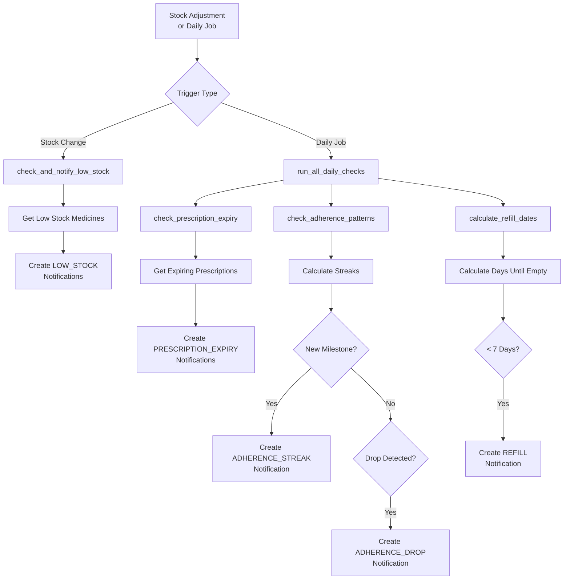

# Phase 4: Notification Triggers Implementation Plan

## Overview

This plan outlines the implementation of automatic notification triggers for the Pillio Health Hub. Phase 4 focuses on creating background job infrastructure and notification generation logic.

## Current State Analysis

### Existing Infrastructure
- ✅ **ReminderService** ([`pillio-backend/app/services/reminder_service.py`](pillio-backend/app/services/reminder_service.py:15)) - Has `get_today_reminders()`, `mark_overdue_reminders_as_missed()`, adherence tracking
- ✅ **MedicineService** ([`pillio-backend/app/services/medicine_service.py`](pillio-backend/app/services/medicine_service.py:19)) - Has `get_low_stock_medicines()`, `adjust_stock()`
- ✅ **NotificationService** ([`pillio-backend/app/services/notification_service.py`](pillio-backend/app/services/notification_service.py:15)) - Has notification creation helpers
- ❌ **No Background Scheduler** - Need to add APScheduler
- ❌ **No Prescription Service** - Need to check for expiry tracking

---

## Task List

### Step 1: Add Background Job Dependencies
[ ] Add `apscheduler` to `pillio-backend/requirements.txt`
[ ] Create `pillio-backend/app/core/scheduler.py` - APScheduler setup

### Step 2: Create Notification Trigger Services
[ ] Create `pillio-backend/app/services/notification_triggers.py` - Trigger orchestration
[ ] Add `check_and_notify_low_stock()` method - Trigger on stock changes + daily
[ ] Add `check_prescription_expiry()` method - Daily check for expiring prescriptions
[ ] Add `check_reminder_due()` method - Real-time reminder notifications
[ ] Add `check_adherence_patterns()` method - Streak + drop detection

### Step 3: Create Prescription Service (if not exists)
[ ] Check if prescription service exists
[ ] Create/find `check_expiring_prescriptions()` method
[ ] Create `get_expiring_prescriptions()` helper

### Step 4: Integrate Triggers with Stock Adjustments
[ ] Modify `MedicineService.adjust_stock()` to trigger low stock check
[ ] Modify `MedicineService.update_medicine()` to check stock threshold changes

### Step 5: Create Trigger API Endpoints
[ ] Add `POST /notifications/triggers/check-low-stock` - Manual low stock check
[ ] Add `POST /notifications/triggers/check-prescriptions` - Manual prescription check
[ ] Add `POST /notifications/triggers/check-adherence` - Manual adherence check
[ ] Add `POST /notifications/triggers/run-all` - Run all checks

### Step 6: Update Main.py with Scheduler
[ ] Import scheduler in `pillio-backend/app/main.py`
[ ] Add scheduler startup/shutdown in lifespan
[ ] Configure daily/weekly jobs

### Step 7: Add Refill Calculation Logic
[ ] Add `calculate_days_until_empty()` to MedicineService
[ ] Add `create_refill_notification()` trigger in notification service

### Step 8: Testing & Validation
[ ] Test low stock trigger after stock adjustment
[ ] Test prescription expiry detection
[ ] Test adherence streak detection
[ ] Verify notifications are created correctly

---

## Detailed Implementation Steps

### Step 1: Add Dependencies

**File:** `pillio-backend/requirements.txt`

Add:
```
apscheduler==3.10.4
```

### Step 2: Create Scheduler Core

**File:** `pillio-backend/app/core/scheduler.py`

```python
from apscheduler.schedulers.asyncio import AsyncIOScheduler
from apscheduler.triggers.cron import CronTrigger
from datetime import datetime

scheduler = AsyncIOScheduler()

async def run_daily_notifications():
    """Run all daily notification checks"""
    # Import here to avoid circular imports
    from app.services.notification_triggers import run_all_daily_checks
    await run_all_daily_checks()

def setup_scheduler():
    """Configure scheduled jobs"""
    # Daily notification check at 8 AM
    scheduler.add_job(
        run_daily_notifications,
        CronTrigger(hour=8, minute=0),
        id='daily_notifications',
        name='Daily notification checks',
        replace_existing=True
    )
```

### Step 3: Create Notification Triggers Service

**File:** `pillio-backend/app/services/notification_triggers.py`

Key methods:
- `check_and_notify_low_stock(user_id)` - Check stock levels
- `check_prescription_expiry(user_id)` - Check expiring prescriptions
- `check_adherence_patterns(user_id)` - Detect streaks and drops
- `calculate_refill_dates(user_id)` - Calculate when medicines will run out
- `run_all_daily_checks()` - Run all checks for all users

### Step 4: Modify Medicine Service for Stock Changes

**File:** `pillio-backend/app/services/medicine_service.py`

Add trigger call after stock adjustment:

```python
async def adjust_stock(self, ...):
    # ... existing logic ...
    
    # Trigger low stock notification check
    from app.services.notification_triggers import check_and_notify_low_stock
    await check_and_notify_low_stock(user_id, medicine.id)
```

### Step 5: Create Trigger Endpoints

**File:** `pillio-backend/app/api/notifications.py`

Add at end of file:
```python
@router.post("/triggers/check-low-stock")
async def trigger_low_stock_check(...):
    """Manually trigger low stock check"""
    
@router.post("/triggers/check-prescriptions")
async def trigger_prescription_check(...):
    """Manually trigger prescription expiry check"""
    
@router.post("/triggers/run-all")
async def trigger_all_checks(...):
    """Run all notification checks"""
```

---

## Notification Trigger Logic

### Low Stock Notification Flow
```
Stock Adjustment → Check if stock ≤ min_stock → 
  If below threshold → Create LOW_STOCK notification
```

### Prescription Expiry Flow
```
Daily Job → Get all prescriptions for user → 
  Check expiry_date within 30 days → 
  Create PRESCRIPTION_EXPIRY notification
```

### Adherence Pattern Flow
```
Daily Job → Get adherence streak → 
  If new streak milestone (3, 7, 14, 30 days) → 
  Create ADHERENCE_STREAK notification
  If adherence rate dropped > 20% → 
  Create ADHERENCE_DROP notification
```

### Refill Notification Flow
```
Daily Job → Calculate consumption rate → 
  Estimate days until empty → 
  If < 7 days → Create REFILL notification
```

---

## Files to Create/Modify

### New Files
| File | Purpose |
|------|---------|
| `pillio-backend/app/core/scheduler.py` | APScheduler configuration |
| `pillio-backend/app/services/notification_triggers.py` | Trigger orchestration logic |

### Modified Files
| File | Changes |
|------|---------|
| `pillio-backend/requirements.txt` | Add apscheduler |
| `pillio-backend/app/main.py` | Initialize scheduler |
| `pillio-backend/app/services/medicine_service.py` | Add trigger calls |
| `pillio-backend/app/api/notifications.py` | Add trigger endpoints |

---

## Mermaid Diagram: Notification Trigger Flow



---

## Success Criteria

1. ✅ Background scheduler runs daily at configured time
2. ✅ Low stock notifications trigger after stock adjustments
3. ✅ Prescription expiry notifications created before expiry
4. ✅ Adherence streak notifications celebrate milestones
5. ✅ Adherence drop notifications alert users
6. ✅ Refill notifications warn before running out
7. ✅ Manual trigger endpoints work for testing
8. ✅ No duplicate notifications created
