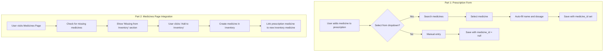

# Prescription-Medicines Integration Plan

## Overview

This plan outlines improvements to create better integration between Prescriptions and Medicines pages:

1. **Prescription Form**: Add medicine dropdown selection from inventory
2. **Medicines Page**: Show prescription medicines not in inventory with "Add to Inventory" option

---

## Part 1: Prescription Form - Medicine Selection Dropdown

### 1.1 Backend API

#### Option A: Use existing search endpoint (Simpler)
The existing [`GET /medicines/search`](pillio-backend/app/api/medicines.py:127) endpoint already supports searching medicines.

**Usage:**
```
GET /medicines/search?q=asp
```

Returns list of medicines matching the query.

#### Option B: Add dedicated endpoint for dropdown (Better UX)
Add new endpoint with simpler response for dropdowns:

**New Endpoint:**
```python
@router.get("/for-prescription", response_model=list[MedicineDropdownItem])
async def get_medicines_for_prescription(
    search: Optional[str] = Query(None),
    db: AsyncSession = Depends(get_db),
    current_user: User = Depends(get_current_user)
):
    """Get medicines formatted for prescription dropdown"""
```

**Response Schema:**
```python
class MedicineDropdownItem(BaseModel):
    id: int
    name: str
    dosage: str  # e.g., "500mg"
    form: str    # e.g., "tablet"
```

### 1.2 Frontend - Medicine Selection Component

#### New Component: `MedicineSelect.tsx`

```typescript
interface MedicineSelectProps {
  value: string; // medicine_id as string
  onChange: (value: string, medicine?: MedicineDropdownItem) => void;
  existingMedicines?: MedicineDropdownItem[];
  selectedId?: number;
}

function MedicineSelect({ 
  value, 
  onChange, 
  existingMedicines,
  selectedId 
}: MedicineSelectProps) {
  const [search, setSearch] = useState('');
  const [results, setResults] = useState<MedicineDropdownItem[]>([]);
  const [isOpen, setIsOpen] = useState(false);

  // Search medicines when typing
  useEffect(() => {
    if (search.length >= 2) {
      medicinesApi.search(search).then(res => setResults(res.data));
    } else {
      setResults([]);
    }
  }, [search]);

  return (
    <div className="relative">
      <Input
        value={search}
        onChange={(e) => {
          setSearch(e.target.value);
          onChange(e.target.value);
        }}
        placeholder="Search medicines..."
        onFocus={() => setIsOpen(true)}
      />
      
      {isOpen && results.length > 0 && (
        <div className="absolute z-10 w-full border rounded-md bg-popover">
          {results.map((med) => (
            <div
              key={med.id}
              className="px-4 py-2 hover:bg-accent cursor-pointer"
              onClick={() => {
                onChange(String(med.id), med);
                setSearch(`${med.name} - ${med.dosage}`);
                setIsOpen(false);
              }}
            >
              <div className="font-medium">{med.name}</div>
              <div className="text-sm text-muted-foreground">
                {med.dosage} - {med.form}
              </div>
            </div>
          ))}
        </div>
      )}
      
      <Button
        type="button"
        variant="ghost"
        size="sm"
        onClick={() => {
          // Clear selection, switch to manual entry
          onChange('');
          setSearch('');
        }}
      >
        Manual Entry
      </Button>
    </div>
  );
}
```

### 1.3 Updated Prescription Form Logic

**File:** [`src/components/prescription/PrescriptionFormDialog.tsx`](src/components/prescription/PrescriptionFormDialog.tsx)

**Changes:**
1. Add state for medicines list (fetched from API)
2. Add `MedicineSelect` component for each medicine entry
3. When medicine selected from dropdown:
   - Set `medicine_id` field
   - Auto-fill `medicine_name` from selected medicine
   - Auto-fill `dosage` from selected medicine
4. Allow manual override (user can change the auto-filled values)
5. When manual entry (no medicine_id):
   - `medicine_id` = null
   - `medicine_name` = user-entered value

**Medicine Entry State:**
```typescript
interface MedicineEntry {
  id?: number;              // prescription_medicine.id (for editing)
  medicine_id?: number | null; // links to medicines.id (null = manual entry)
  medicine_name: string;
  dosage: string;
  frequency: string;
  duration_days: number;
  instructions?: string;
}
```

---

## Part 2: Medicines Page - Missing from Inventory

### 2.1 Backend - Get Prescription Medicines Not in Inventory

**New Endpoint:**
```python
@router.get("/missing-from-inventory", response_model=list[PrescriptionMedicineResponse])
async def get_missing_from_inventory(
    db: AsyncSession = Depends(get_db),
    current_user: User = Depends(get_current_user)
):
    """
    Get prescription medicines that are not in the user's inventory.
    Useful for identifying medicines to add.
    """
```

**SQL Query Logic:**
```python
# Get prescription medicines where medicine_id is null
# OR where medicine_id exists but medicine was deleted/hidden
# Group by unique medicine_name + dosage combinations
```

**Response:**
```json
[
  {
    "id": 1,
    "prescription_id": 10,
    "medicine_id": null,
    "medicine_name": "Amoxicillin",
    "dosage": "500mg",
    "frequency": "Twice daily",
    "duration_days": 7,
    "instructions": "Take with food",
    "prescriptions_count": 2  // Appears in 2 prescriptions
  }
]
```

### 2.2 New Component: `MissingMedicineCard.tsx`

```typescript
interface MissingMedicineCardProps {
  medicine: MissingMedicine;
  onAddToInventory: (medicine: MissingMedicine) => void;
  onHide: (id: number) => void;
}

function MissingMedicineCard({ 
  medicine, 
  onAddToInventory, 
  onHide 
}: MissingMedicineCardProps) {
  return (
    <Card>
      <CardHeader>
        <CardTitle>{medicine.medicine_name}</CardTitle>
        <CardSubtitle>{medicine.dosage}</CardSubtitle>
      </CardHeader>
      <CardContent>
        <div className="space-y-2 text-sm">
          <p><strong>Frequency:</strong> {medicine.frequency}</p>
          <p><strong>Duration:</strong> {medicine.duration_days} days</p>
          {medicine.instructions && (
            <p><strong>Instructions:</strong> {medicine.instructions}</p>
          )}
          <p className="text-muted-foreground">
            Appears in {medicine.prescriptions_count} prescription(s)
          </p>
        </div>
        
        <div className="flex gap-2 mt-4">
          <Button onClick={() => onAddToInventory(medicine)}>
            Add to Inventory
          </Button>
          <Button variant="outline" onClick={() => onHide(medicine.id)}>
            Hide
          </Button>
        </div>
      </CardContent>
    </Card>
  );
}
```

### 2.3 Updated Medicines Page

**File:** [`src/pages/MedicinesPage.tsx`](src/pages/MedicinesPage.tsx)

**Add new section:**
```typescript
// Fetch missing medicines
const { data: missingMedicines } = useQuery({
  queryKey: ['missing-from-inventory'],
  queryFn: () => medicinesApi.getMissingFromInventory(),
});

// Show section if there are missing medicines
{missingMedicines?.length > 0 && (
  <div className="space-y-4">
    <h2 className="text-lg font-semibold">
      Missing from Inventory ({missingMedicines.length})
    </h2>
    <p className="text-sm text-muted-foreground">
      These medicines appear in your prescriptions but not in your inventory.
    </p>
    <div className="grid gap-4 md:grid-cols-2 lg:grid-cols-3">
      {missingMedicines.map((med) => (
        <MissingMedicineCard
          key={med.id}
          medicine={med}
          onAddToInventory={handleAddToInventory}
          onHide={handleHideMissing}
        />
      ))}
    </div>
  </div>
)}
```

### 2.4 "Add to Inventory" Logic

When user clicks "Add to Inventory":
1. Pre-fill the Medicine form with prescription medicine data
2. Show confirmation dialog
3. Create medicine in inventory
4. Update all prescription medicines to link to new medicine_id

**Backend Service Method:**
```python
async def add_prescription_medicine_to_inventory(
    self,
    user_id: int,
    prescription_medicine: PrescriptionMedicine,
    medicine_data: MedicineCreate
) -> Medicine:
    """Create medicine from prescription and link it"""
    # 1. Create medicine in inventory
    medicine = await self.create_medicine(user_id, medicine_data)
    
    # 2. Update prescription medicine to link to new medicine
    prescription_medicine.medicine_id = medicine.id
    await self.db.commit()
    
    return medicine
```

---

## Data Flow Diagram



---

## Files to Create/Modify

### New Files

| File | Description |
|------|-------------|
| `src/components/medicine/MedicineSelect.tsx` | Medicine dropdown component |
| `src/components/medicine/MissingMedicineCard.tsx` | Card for medicines missing from inventory |

### Modified Files

| File | Changes |
|------|---------|
| `pillio-backend/app/api/medicines.py` | Add `/for-prescription` and `/missing-from-inventory` endpoints |
| `pillio-backend/app/services/medicine_service.py` | Add method to link prescription medicines |
| `src/lib/medicines-api.ts` | Add new API methods |
| `src/components/prescription/PrescriptionFormDialog.tsx` | Add medicine dropdown selection |
| `src/pages/MedicinesPage.tsx` | Add 'Missing from Inventory' section |

---

## API Endpoints Summary

### Existing (reuse)
- `GET /medicines/search?q=` - Search medicines for dropdown

### New Endpoints
| Method | Path | Description |
|--------|------|-------------|
| GET | `/medicines/for-prescription` | Get medicines formatted for dropdown |
| GET | `/medicines/missing-from-inventory` | Get prescription medicines not in inventory |
| POST | `/medicines/from-prescription` | Create medicine from prescription medicine |

---

## User Experience

### Scenario 1: Adding Prescription with Existing Medicine
1. User clicks "Add Medicine" in prescription form
2. User searches for "Aspirin" in dropdown
3. Selects "Aspirin - 500mg" from results
4. Dosage auto-fills with "500mg"
5. User can override if needed
6. Prescription saved with `medicine_id` linked to inventory

### Scenario 2: Adding Prescription with New Medicine
1. User clicks "Add Medicine" in prescription form
2. Medicine not found in dropdown
3. User clicks "Manual Entry"
4. User types: "New Medicine" as name
5. User enters dosage: "100mg"
6. Prescription saved with `medicine_id = null`

### Scenario 3: Adding Missing Medicine to Inventory
1. User visits Medicines Page
2. Sees "Missing from Inventory" section
3. Clicks "Add to Inventory" on "Amoxicillin - 500mg" card
4. Medicine created with pre-filled data
5. All prescriptions now link to this inventory medicine
