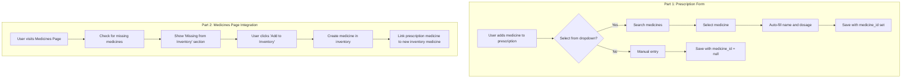

# Prescription-Medicines Integration Plan

## Overview

This plan outlines improvements to create better integration between Prescriptions and Medicines pages:

1. **Prescription Form**: Add medicine dropdown selection from inventory
2. **Medicines Page**: Show prescription medicines not in inventory with "Add to Inventory" option

---

## Progress Summary

### ✅ Completed

| Item | Status | File |
|------|--------|------|
| GET /medicines/for-prescription endpoint | Done | `pillio-backend/app/api/medicines.py:183-224` |
| GET /medicines/missing-from-inventory endpoint | Done | `pillio-backend/app/api/medicines.py:227-281` |
| MedicineDropdownItem schema (backend) | Done | `pillio-backend/app/api/medicines.py:45-51` |
| MissingMedicineItem schema (backend) | Done | `pillio-backend/app/api/medicines.py:54-63` |
| MedicineDropdownItem interface (frontend) | Done | `src/lib/medicines-api.ts:26-33` |
| MissingMedicineItem interface (frontend) | Done | `src/lib/medicines-api.ts:35-45` |
| getForPrescription API method | Done | `src/lib/medicines-api.ts:149-151` |
| getMissingFromInventory API method | Done | `src/lib/medicines-api.ts:153-155` |

### 🔄 In Progress

| Item | File |
|------|------|
| POST /medicines/from-prescription endpoint | `pillio-backend/app/api/medicines.py` |
| add_prescription_medicine_to_inventory service method | `pillio-backend/app/services/medicine_service.py` |

### ⏳ Remaining

| Item | File |
|------|------|
| MedicineSelect.tsx component | `src/components/medicine/MedicineSelect.tsx` |
| MissingMedicineCard.tsx component | `src/components/medicine/MissingMedicineCard.tsx` |
| addToInventoryFromPrescription API method | `src/lib/medicines-api.ts` |
| Update PrescriptionFormDialog.tsx | `src/components/prescription/PrescriptionFormDialog.tsx` |
| Update MedicinesPage.tsx | `src/pages/MedicinesPage.tsx` |

---

## Part 1: Prescription Form - Medicine Selection Dropdown

### 1.1 Backend (Done)

The following are already implemented:
- [`GET /medicines/for-prescription`](pillio-backend/app/api/medicines.py:183) endpoint
- `MedicineDropdownItem` schema

### 1.2 Frontend Component: MedicineSelect.tsx

**New Component:** `src/components/medicine/MedicineSelect.tsx`

```typescript
interface MedicineSelectProps {
  value: string;
  onChange: (value: string, medicine?: MedicineDropdownItem) => void;
  placeholder?: string;
}

function MedicineSelect({ 
  value, 
  onChange, 
  placeholder = "Search medicines..." 
}: MedicineSelectProps) {
  const [search, setSearch] = useState('');
  const [results, setResults] = useState<MedicineDropdownItem[]>([]);
  const [isOpen, setIsOpen] = useState(false);
  const [isLoading, setIsLoading] = useState(false);

  // Search medicines when typing (debounced)
  useEffect(() => {
    const timer = setTimeout(async () => {
      if (search.length >= 2) {
        setIsLoading(true);
        try {
          const res = await medicinesApi.getForPrescription(search);
          setResults(res.data);
        } finally {
          setIsLoading(false);
        }
      } else {
        setResults([]);
      }
    }, 300);

    return () => clearTimeout(timer);
  }, [search]);

  return (
    <div className="relative">
      <Input
        value={search}
        onChange={(e) => {
          setSearch(e.target.value);
          onChange(e.target.value);
        }}
        placeholder={placeholder}
        onFocus={() => setIsOpen(true)}
      />
      
      {isOpen && (search.length >= 2) && (
        <div className="absolute z-10 w-full border rounded-md bg-popover mt-1 max-h-60 overflow-auto">
          {isLoading ? (
            <div className="p-4 text-center text-muted-foreground">
              Searching...
            </div>
          ) : results.length > 0 ? (
            results.map((med) => (
              <div
                key={med.id}
                className="px-4 py-2 hover:bg-accent cursor-pointer"
                onClick={() => {
                  onChange(String(med.id), med);
                  setSearch(`${med.name} - ${med.dosage}`);
                  setIsOpen(false);
                }}
              >
                <div className="font-medium">{med.name}</div>
                <div className="text-sm text-muted-foreground">
                  {med.dosage} - {med.form}
                </div>
              </div>
            ))
          ) : (
            <div className="p-4 text-center text-muted-foreground">
              No medicines found
            </div>
          )}
        </div>
      )}
    </div>
  );
}
```

### 1.3 Updated Prescription Form Logic

**File:** [`src/components/prescription/PrescriptionFormDialog.tsx`](src/components/prescription/PrescriptionFormDialog.tsx)

**Changes:**
1. Import `MedicineSelect` component and `MedicineDropdownItem` type
2. Add state for selected medicine details per medicine entry
3. Replace medicine name Input with `MedicineSelect` component
4. When medicine selected from dropdown:
   - Set `medicine_id` field
   - Auto-fill `medicine_name` from selected medicine
   - Auto-fill `dosage` from selected medicine
5. Allow manual override (user can change the auto-filled values)

**Medicine Entry State:**
```typescript
interface MedicineEntry extends PrescriptionMedicineCreate {
  medicine_id?: number | null;
  selectedMedicine?: MedicineDropdownItem | null;
}
```

---

## Part 2: Medicines Page - Missing from Inventory

### 2.1 Backend - Create Medicine from Prescription

**New Endpoint:**
```python
@router.post("/from-prescription", response_model=MedicineSchema)
async def create_medicine_from_prescription(
    prescription_medicine_id: int = Query(..., description="Prescription medicine ID"),
    db: AsyncSession = Depends(get_db),
    current_user: User = Depends(get_current_user),
    medicine_service: MedicineService = Depends(get_medicine_service)
):
    """
    Create a medicine in inventory from a prescription medicine.
    Links all matching prescription medicines to the new inventory medicine.
    """
```

**Service Method:**
```python
async def add_prescription_medicine_to_inventory(
    self,
    user_id: int,
    prescription_medicine_id: int,
    medicine_data: MedicineCreate
) -> Medicine:
    """Create medicine from prescription and link it"""
    # 1. Create medicine in inventory
    medicine = await self.create_medicine(user_id, medicine_data)
    
    # 2. Find all prescription medicines with same name + dosage
    # 3. Update them to link to new medicine
    # 4. Commit changes
    
    return medicine
```

### 2.2 Frontend Component: MissingMedicineCard.tsx

**New Component:** `src/components/medicine/MissingMedicineCard.tsx`

```typescript
interface MissingMedicineCardProps {
  medicine: MissingMedicineItem;
  onAddToInventory: (medicine: MissingMedicineItem) => void;
  onHide: (id: number) => void;
}

function MissingMedicineCard({ 
  medicine, 
  onAddToInventory, 
  onHide 
}: MissingMedicineCardProps) {
  return (
    <Card>
      <CardHeader>
        <CardTitle>{medicine.medicine_name}</CardTitle>
        <CardSubtitle>{medicine.dosage}</CardSubtitle>
      </CardHeader>
      <CardContent>
        <div className="space-y-2 text-sm">
          <p><strong>Frequency:</strong> {medicine.frequency}</p>
          <p><strong>Duration:</strong> {medicine.duration_days} days</p>
          {medicine.instructions && (
            <p><strong>Instructions:</strong> {medicine.instructions}</p>
          )}
          <p className="text-muted-foreground">
            Appears in {medicine.prescriptions_count} prescription(s)
          </p>
        </div>
        
        <div className="flex gap-2 mt-4">
          <Button onClick={() => onAddToInventory(medicine)}>
            Add to Inventory
          </Button>
          <Button variant="outline" onClick={() => onHide(medicine.id)}>
            Hide
          </Button>
        </div>
      </CardContent>
    </Card>
  );
}
```

### 2.3 Updated Medicines Page

**File:** [`src/pages/MedicinesPage.tsx`](src/pages/MedicinesPage.tsx)

**Add new section:**
```typescript
// Fetch missing medicines
const { data: missingMedicines, refetch: refetchMissing } = useQuery({
  queryKey: ['missing-from-inventory'],
  queryFn: () => medicinesApi.getMissingFromInventory(),
});

// Handle add to inventory
const handleAddToInventory = async (medicine: MissingMedicineItem) => {
  // Show MedicineFormDialog with pre-filled data
  setPendingMissingMedicine(medicine);
  setFormDialogOpen(true);
};

// Show section if there are missing medicines
{missingMedicines?.length > 0 && (
  <div className="space-y-4 mt-8">
    <h2 className="text-lg font-semibold">
      Missing from Inventory ({missingMedicines.length})
    </h2>
    <p className="text-sm text-muted-foreground">
      These medicines appear in your prescriptions but not in your inventory.
    </p>
    <div className="grid gap-4 md:grid-cols-2 lg:grid-cols-3">
      {missingMedicines.map((med) => (
        <MissingMedicineCard
          key={med.id}
          medicine={med}
          onAddToInventory={handleAddToInventory}
          onHide={handleHideMissing}
        />
      ))}
    </div>
  </div>
)}
```

---

## Data Flow Diagram



---

## Files to Create/Modify

### New Files

| File | Description |
|------|-------------|
| `src/components/medicine/MedicineSelect.tsx` | Medicine dropdown component |
| `src/components/medicine/MissingMedicineCard.tsx` | Card for medicines missing from inventory |

### Modified Files

| File | Changes |
|------|---------|
| `pillio-backend/app/api/medicines.py` | Add POST /from-prescription endpoint |
| `pillio-backend/app/services/medicine_service.py` | Add add_prescription_medicine_to_inventory method |
| `src/lib/medicines-api.ts` | Add addToInventoryFromPrescription method |
| `src/components/prescription/PrescriptionFormDialog.tsx` | Add medicine dropdown selection |
| `src/pages/MedicinesPage.tsx` | Add 'Missing from Inventory' section |

---

## API Endpoints Summary

### Existing (reuse)
- `GET /medicines/for-prescription` - Get medicines formatted for dropdown
- `GET /medicines/missing-from-inventory` - Get prescription medicines not in inventory

### New Endpoints
| Method | Path | Description |
|--------|------|-------------|
| POST | `/medicines/from-prescription` | Create medicine from prescription medicine |

---

## User Experience

### Scenario 1: Adding Prescription with Existing Medicine
1. User clicks "Add Medicine" in prescription form
2. User searches for "Aspirin" in dropdown
3. Selects "Aspirin - 500mg" from results
4. Dosage auto-fills with "500mg"
5. User can override if needed
6. Prescription saved with `medicine_id` linked to inventory

### Scenario 2: Adding Prescription with New Medicine
1. User clicks "Add Medicine" in prescription form
2. Medicine not found in dropdown
3. User types medicine name manually
4. User enters dosage: "100mg"
5. Prescription saved with `medicine_id = null`

### Scenario 3: Adding Missing Medicine to Inventory
1. User visits Medicines Page
2. Sees "Missing from Inventory" section
3. Clicks "Add to Inventory" on "Amoxicillin - 500mg" card
4. Medicine created with pre-filled data
5. All prescriptions now link to this inventory medicine
