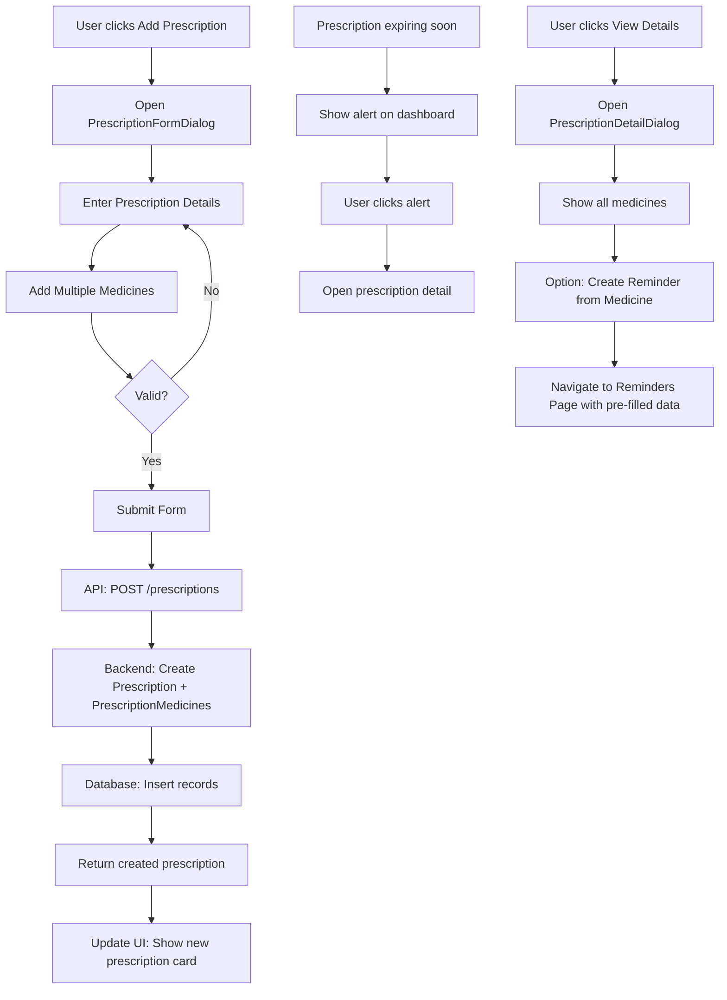

# Prescriptions Page Implementation Plan

## Current State Analysis

### Problem: Single Medicine Limitation
The current [`Prescription`](pillio-backend/app/models/prescription.py:6) model has a **fundamental architectural flaw**:

```python
# Current flawed design - one prescription can only have ONE medicine
medicine_id = Column(Integer, ForeignKey("medicines.id"), nullable=True)
dosage_instructions = Column(Text, nullable=True)
frequency = Column(String(100), nullable=True)
duration_days = Column(Integer, nullable=True)
```

**Issue**: A prescription from a doctor typically contains **multiple medicines** with different dosages, frequencies, and durations. The current design forces each medicine to be a separate prescription, which is incorrect.

### What Already Exists (But Isn't Implemented)
The [`prescription.py`](pillio-backend/app/schemas/prescription.py:1) schema file already has a `PrescriptionMedicine` schema defined, but it's not being used because:
1. No database table to store prescription-medicine relationships
2. No API endpoints for prescriptions
3. No frontend implementation beyond the empty page

---

## Solution: Many-to-Many Design

### Database Schema Changes

```mermaid
erDiagram
    User ||--o{ Prescription : has
    Prescription ||--o{ PrescriptionMedicine : contains
    PrescriptionMedicine ||--|| Medicine : references
    Medicine ||--o{ PrescriptionMedicine : appears_in
    
    User {
        int id PK
        string email
        string name
    }
    
    Prescription {
        int id PK
        int user_id FK
        string doctor_name
        string hospital_clinic
        date prescription_date
        date valid_until
        string notes
        string image_url
        boolean is_active
    }
    
    PrescriptionMedicine {
        int id PK
        int prescription_id FK
        int medicine_id FK
        string dosage
        string frequency
        int duration_days
        string instructions
    }
    
    Medicine {
        int id PK
        int user_id FK
        string name
        string generic_name
        string dosage
        string form
    }
}
```

---

## Implementation Steps

### Phase 1: Backend - Database & Models

#### Step 1.1: Create PrescriptionMedicine Model
**File**: [`pillio-backend/app/models/prescription_medicine.py`](pillio-backend/app/models/prescription_medicine.py)

```python
class PrescriptionMedicine(BaseModel):
    __tablename__ = "prescription_medicines"
    
    prescription_id = Column(Integer, ForeignKey("prescriptions.id", ondelete="CASCADE"), nullable=False)
    medicine_id = Column(Integer, ForeignKey("medicines.id", ondelete="CASCADE"), nullable=True)
    
    # Medicine details (for prescriptions without linked medicine)
    medicine_name = Column(String(255), nullable=False)
    dosage = Column(String(100), nullable=False)
    frequency = Column(String(100), nullable=False)
    duration_days = Column(Integer, nullable=False)
    instructions = Column(Text, nullable=True)
    
    # Relationships
    prescription = relationship("Prescription", back_populates="prescription_medicines")
    medicine = relationship("Medicine", back_populates="prescription_medicines")
```

#### Step 1.2: Update Prescription Model
**File**: [`pillio-backend/app/models/prescription.py`](pillio-backend/app/models/prescription.py)

- Remove single medicine fields: `medicine_id`, `dosage_instructions`, `frequency`, `duration_days`
- Add relationship: `prescription_medicines = relationship("PrescriptionMedicine", back_populates="prescription", cascade="all, delete-orphan")`

#### Step 1.3: Update Medicine Model
**File**: [`pillio-backend/app/models/medicine.py`](pillio-backend/app/models/medicine.py)

- Add relationship: `prescription_medicines = relationship("PrescriptionMedicine", back_populates="medicine")`

#### Step 1.4: Update Models __init__.py
**File**: [`pillio-backend/app/models/__init__.py`](pillio-backend/app/models/__init__.py)

```python
from app.models.medicine import Medicine
from app.models.prescription import Prescription
from app.models.prescription_medicine import PrescriptionMedicine  # NEW
from app.models.reminder import Reminder
```

---

### Phase 2: Backend - Schemas

#### Step 2.1: Update Prescription Schemas
**File**: [`pillio-backend/app/schemas/prescription.py`](pillio-backend/app/schemas/prescription.py)

- Update `PrescriptionBase`: Remove `medicine_id`, `dosage_instructions`, `frequency`, `duration_days`
- Update `PrescriptionCreate`: Ensure `medicines: List[PrescriptionMedicine]` is required
- Update `PrescriptionUpdate`: Add `medicine_ids` for adding/removing medicines
- Create new schema `PrescriptionMedicineCreate`

#### Step 2.2: Create PrescriptionMedicine Schema (Optional)
Add to [`pillio-backend/app/schemas/prescription.py`](pillio-backend/app/schemas/prescription.py):

```python
class PrescriptionMedicineCreate(BaseModel):
    medicine_id: Optional[int] = None
    medicine_name: str
    dosage: str
    frequency: str
    duration_days: int
    instructions: Optional[str] = None
```

---

### Phase 3: Backend - Service Layer

#### Step 3.1: Create PrescriptionService
**File**: [`pillio-backend/app/services/prescription_service.py`](pillio-backend/app/services/prescription_service.py)

```python
class PrescriptionService:
    async def create_prescription(user_id: int, prescription_data: PrescriptionCreate) -> Prescription
    async def get_prescriptions(user_id: int, filters: PrescriptionFilter) -> tuple
    async def get_prescription_by_id(prescription_id: int, user_id: int) -> Optional[Prescription]
    async def update_prescription(prescription_id: int, user_id: int, update_data: PrescriptionUpdate) -> Prescription
    async def delete_prescription(prescription_id: int, user_id: int) -> bool
    async def add_medicine_to_prescription(prescription_id: int, medicine_data: PrescriptionMedicineCreate) -> PrescriptionMedicine
    async def remove_medicine_from_prescription(prescription_id: int, prescription_medicine_id: int) -> bool
    async def get_expiring_prescriptions(user_id: int, days_ahead: int) -> list
```

---

### Phase 4: Backend - API Router

#### Step 4.1: Create Prescriptions API Router
**File**: [`pillio-backend/app/api/prescriptions.py`](pillio-backend/app/api/prescriptions.py)

```python
router = APIRouter()

@router.post("/", response_model=PrescriptionWithMedicines)
async def create_prescription(...)

@router.get("/", response_model=PaginatedResponse[PrescriptionWithMedicines])
async def get_prescriptions(...)

@router.get("/{prescription_id}", response_model=PrescriptionWithMedicines)
async def get_prescription(...)

@router.put("/{prescription_id}", response_model=PrescriptionWithMedicines)
async def update_prescription(...)

@router.delete("/{prescription_id}")
async def delete_prescription(...)

@router.post("/{prescription_id}/medicines", response_model=PrescriptionMedicine)
async def add_medicine_to_prescription(...)

@router.delete("/{prescription_id}/medicines/{prescription_medicine_id}")
async def remove_medicine_from_prescription(...)

@router.get("/expiring", response_model=list[PrescriptionWithMedicines])
async def get_expiring_prescriptions(...)
```

#### Step 4.2: Register Router in main.py
**File**: [`pillio-backend/app/main.py`](pillio-backend/app/main.py:142)

```python
from app.api.prescriptions import router as prescriptions_router

# Add after reminders_router
app.include_router(
    prescriptions_router,
    prefix=f"{settings.api_v1_str}/prescriptions",
    tags=["Prescriptions"]
)
```

---

### Phase 5: Frontend - API Client

#### Step 5.1: Create Prescriptions API Client
**File**: [`src/lib/prescriptions-api.ts`](src/lib/prescriptions-api.ts)

```typescript
export interface PrescriptionMedicine {
  id?: number
  medicine_id?: number
  medicine_name: string
  dosage: string
  frequency: string
  duration_days: number
  instructions?: string
}

export interface Prescription {
  id: number
  user_id: number
  doctor_name: string
  hospital_clinic?: string
  prescription_date: string
  valid_until?: string
  notes?: string
  image_url?: string
  is_active: boolean
  medicines: PrescriptionMedicine[]
  is_expired?: boolean
  days_until_expiry?: number
}

export const prescriptionsApi = {
  getAll: (params?: PrescriptionFilters) => Promise<PaginatedResponse<Prescription>>,
  getById: (id: number) => Promise<Prescription>,
  create: (data: PrescriptionCreate) => Promise<Prescription>,
  update: (id: number, data: PrescriptionUpdate) => Promise<Prescription>,
  delete: (id: number) => Promise<void>,
  addMedicine: (prescriptionId: number, medicine: PrescriptionMedicine) => Promise<PrescriptionMedicine>,
  removeMedicine: (prescriptionId: number, medicineId: number) => Promise<void>,
}
```

---

### Phase 6: Frontend - Components

#### Step 6.1: Create Prescription Form Dialog
**File**: [`src/components/prescription/PrescriptionFormDialog.tsx`](src/components/prescription/PrescriptionFormDialog.tsx)

Features:
- Doctor name and hospital/clinic fields
- Prescription date and valid until date
- Notes field
- **Dynamic medicines list** - add/remove multiple medicines
- Each medicine entry: name, dosage, frequency, duration, instructions
- Optional image upload for scanned prescription

#### Step 6.2: Create Prescription Card Component
**File**: [`src/components/prescription/PrescriptionCard.tsx`](src/components/prescription/PrescriptionCard.tsx)

Display:
- Doctor name and date
- List of all medicines with dosages
- Expiry status indicator
- Actions: edit, delete, view details

#### Step 6.3: Create Prescription Detail View
**File**: [`src/components/prescription/PrescriptionDetailDialog.tsx`](src/components/prescription/PrescriptionDetailDialog.tsx)

- Full prescription details
- All medicines listed
- Option to create reminders from medicines
- Image viewer for uploaded prescription

#### Step 6.4: Create Delete Confirmation Dialog
**File**: [`src/components/prescription/DeletePrescriptionDialog.tsx`](src/components/prescription/DeletePrescriptionDialog.tsx)

#### Step 6.5: Update Prescriptions Page
**File**: [`src/pages/PrescriptionsPage.tsx`](src/pages/PrescriptionsPage.tsx)

```typescript
// Features to implement:
// - List view of prescriptions (cards or table)
// - Filter by: active/expired, doctor, date range
// - Search by doctor name or medicine name
// - Add new prescription button
// - Empty state with call-to-action
// - Status badges (active, expiring soon, expired)
```

---

### Phase 7: Additional Features

#### Feature 7.1: Expiry Notifications
- Check prescriptions expiring within 7/14/30 days
- Show alerts on dashboard
- Send notifications

#### Feature 7.2: Quick Add from Prescription to Inventory
- When viewing prescription, quick-add medicines to inventory
- Link prescription medicines to inventory medicines

#### Feature 7.3: Create Reminders from Prescription
- Select medicines from prescription
- Create reminders with prescription's frequency and duration
- Auto-calculate reminder schedule

#### Feature 7.4: Prescription Image Upload
- Upload scanned prescription images
- Store in uploads directory
- View in detail dialog

#### Feature 7.5: Search within Prescriptions
- Search by doctor name
- Search by medicine name
- Search by hospital/clinic

---

## Files to Create/Modify Summary

### New Files to Create

| File | Description |
|------|-------------|
| `pillio-backend/app/models/prescription_medicine.py` | PrescriptionMedicine model |
| `pillio-backend/app/services/prescription_service.py` | Prescription service layer |
| `pillio-backend/app/api/prescriptions.py` | Prescriptions API router |
| `src/lib/prescriptions-api.ts` | Frontend API client |
| `src/components/prescription/PrescriptionFormDialog.tsx` | Form for creating/editing |
| `src/components/prescription/PrescriptionCard.tsx` | Card display component |
| `src/components/prescription/PrescriptionDetailDialog.tsx` | Detail view dialog |
| `src/components/prescription/DeletePrescriptionDialog.tsx` | Delete confirmation |

### Files to Modify

| File | Changes |
|------|---------|
| `pillio-backend/app/models/prescription.py` | Remove single medicine fields, add relationship |
| `pillio-backend/app/models/medicine.py` | Add prescription_medicines relationship |
| `pillio-backend/app/models/__init__.py` | Export PrescriptionMedicine |
| `pillio-backend/app/schemas/prescription.py` | Update schemas for multiple medicines |
| `pillio-backend/app/main.py` | Register prescriptions router |
| `src/pages/PrescriptionsPage.tsx` | Full implementation |
| `src/components/layout/Sidebar.tsx` | Update active nav state |

---

## Migration Strategy

Since this changes the database schema significantly:

1. **Create migration script** (or use)
2 Alembic if available. **Data migration**:
   - For prescriptions with `medicine_id` set, create corresponding `PrescriptionMedicine` records
   - Copy `dosage_instructions`, `frequency`, `duration_days` to new table
3. **Test thoroughly** with existing data
4. **Backup database** before migration

---

## Mermaid: Complete Flow


