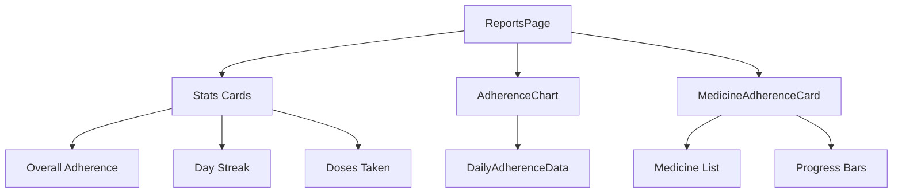

# Reports Page Implementation Plan

## Overview
Implement the Reports page with real backend data, including:
- Weekly adherence chart with real data
- Day streak calculation
- Doses taken in last 30 days
- Per-medicine adherence breakdown

## Current State Analysis

### Backend (pillio-backend)
- ✅ [`get_adherence_stats()`](pillio-backend/app/services/reminder_service.py:278) - Returns total_scheduled, taken, skipped, missed, adherence_rate
- ✅ [`/reminders/adherence/stats`](pillio-backend/app/api/reminders.py:439) endpoint - Accepts start_date and end_date

### Frontend (src)
- ✅ [`AdherenceStats`](src/lib/reminders-api.ts:99) interface - Defines adherence stats types
- ✅ [`getAdherenceStats()`](src/lib/reminders-api.ts:172) API function
- ❌ [`ReportsPage.tsx`](src/pages/ReportsPage.tsx:1) - Uses static data
- ❌ [`AdherenceChart.tsx`](src/components/analytics/AdherenceChart.tsx:1) - Uses mock data

## Implementation Plan

### Phase 1: Backend - New API Endpoints

#### 1.1 Daily Adherence Endpoint
**Purpose**: Get daily adherence data for the chart

**New Endpoint**: `GET /reminders/adherence/daily`

**Response Schema**:
```typescript
interface DailyAdherenceData {
  date: string;       // "YYYY-MM-DD"
  day: string;        // "Mon", "Tue", etc.
  scheduled: number;
  taken: number;
  skipped: number;
  missed: number;
  adherence_rate: number;  // percentage
}
```

**Service Method**: Add to [`reminder_service.py`](pillio-backend/app/services/reminder_service.py)
```python
async def get_daily_adherence(
    self, user_id: int, days: int = 7
) -> List[dict]:
    """Get daily adherence data for the past N days"""
```

#### 1.2 Day Streak Endpoint
**Purpose**: Calculate the current day streak of taking medications on time

**New Endpoint**: `GET /reminders/adherence/streak`

**Response Schema**:
```typescript
interface DayStreak {
  current_streak: number;       // Current streak in days
  longest_streak: number;       // Longest streak ever
  last_taken_date: string | null;  // Last date with 100% adherence
}
```

**Service Method**: Add to [`reminder_service.py`](pillio-backend/app/services/reminder_service.py)
```python
async def get_adherence_streak(self, user_id: int) -> dict:
    """Calculate current and longest adherence streak"""
```

#### 1.3 Per-Medicine Adherence Endpoint
**Purpose**: Get adherence breakdown by medicine

**New Endpoint**: `GET /reminders/adherence/by-medicine`

**Query Parameters**:
- `start_date`: date (required)
- `end_date`: date (required)

**Response Schema**:
```typescript
interface MedicineAdherence {
  medicine_id: number;
  medicine_name: string;
  total_scheduled: number;
  taken: number;
  skipped: number;
  missed: number;
  adherence_rate: number;  // percentage
}

interface MedicineAdherenceResponse {
  medicines: MedicineAdherence[];
  overall_adherence: number;
}
```

**Service Method**: Add to [`reminder_service.py`](pillio-backend/app/services/reminder_service.py)
```python
async def get_medicine_adherence(
    self, user_id: int, start_date: date, end_date: date
) -> dict:
    """Get adherence breakdown by medicine"""
```

### Phase 2: Frontend - API Updates

#### 2.1 Update [`src/lib/reminders-api.ts`](src/lib/reminders-api.ts)

Add new interfaces and API functions:
```typescript
export interface DailyAdherenceData {
  date: string;
  day: string;
  scheduled: number;
  taken: number;
  skipped: number;
  missed: number;
  adherence_rate: number;
}

export interface DayStreak {
  current_streak: number;
  longest_streak: number;
  last_taken_date: string | null;
}

export interface MedicineAdherence {
  medicine_id: number;
  medicine_name: string;
  total_scheduled: number;
  taken: number;
  skipped: number;
  missed: number;
  adherence_rate: number;
}

export interface MedicineAdherenceResponse {
  medicines: MedicineAdherence[];
  overall_adherence: number;
}

// Add new API functions
getDailyAdherence: (days?: number) => Promise<AxiosResponse<DailyAdherenceData[]>>,
getAdherenceStreak: () => Promise<AxiosResponse<DayStreak>>,
getMedicineAdherence: (startDate: string, endDate: string) => Promise<AxiosResponse<MedicineAdherenceResponse>>,
```

### Phase 3: Frontend - Component Updates

#### 3.1 Update [`AdherenceChart.tsx`](src/components/analytics/AdherenceChart.tsx)

**Changes**:
- Accept `data` prop instead of using mock data
- Add loading state
- Show actual scheduled vs taken counts in tooltip

**New Props**:
```typescript
interface AdherenceChartProps {
  data?: DailyAdherenceData[];
  showLoading?: boolean;
}
```

#### 3.2 Create [`MedicineAdherenceCard.tsx`](src/components/analytics/MedicineAdherenceCard.tsx)

**New Component**: Display per-medicine adherence breakdown with progress bars

**Features**:
- Medicine name
- Adherence percentage
- Progress bar visualization
- Taken/Skipped/Missed counts

#### 3.3 Update [`ReportsPage.tsx`](src/pages/ReportsPage.tsx)

**Changes**:
- Add data fetching using React Query or useEffect
- Add loading states for all stats
- Show skeleton loaders while data loads
- Display error states if API fails
- Connect all stats to real data:
  - Overall Adherence → from `getAdherenceStats`
  - Day Streak → from `getAdherenceStreak`
  - Doses Taken → from `getAdherenceStats` (taken count)
  - Chart → from `getDailyAdherence`
- Add Medicine Adherence section

**Data Fetching Strategy**:
```typescript
// Use React Query for data fetching
const { data: adherenceStats } = useQuery({
  queryKey: ['adherenceStats'],
  queryFn: () => remindersApi.getAdherenceStats(startDate, endDate)
});

const { data: dayStreak } = useQuery({
  queryKey: ['adherenceStreak'],
  queryFn: () => remindersApi.getAdherenceStreak()
});

const { data: dailyAdherence } = useQuery({
  queryKey: ['dailyAdherence'],
  queryFn: () => remindersApi.getDailyAdherence(7)
});

const { data: medicineAdherence } = useQuery({
  queryKey: ['medicineAdherence'],
  queryFn: () => remindersApi.getMedicineAdherence(startDate, endDate)
});
```

### Phase 4: Component Structure



## Implementation Order

1. Add backend service methods for:
   - `get_daily_adherence()`
   - `get_adherence_streak()`
   - `get_medicine_adherence()`

2. Add backend API endpoints for the above

3. Update frontend API types and functions

4. Update AdherenceChart to accept data prop

5. Create MedicineAdherenceCard component

6. Update ReportsPage with data fetching and loading states

7. Test integration with real data

## Files to Modify/Create

### Backend
- [`pillio-backend/app/services/reminder_service.py`](pillio-backend/app/services/reminder_service.py) - Add 3 new methods
- [`pillio-backend/app/api/reminders.py`](pillio-backend/app/api/reminders.py) - Add 3 new endpoints

### Frontend
- [`src/lib/reminders-api.ts`](src/lib/reminders-api.ts) - Add interfaces and API functions
- [`src/components/analytics/AdherenceChart.tsx`](src/components/analytics/AdherenceChart.tsx) - Update to accept data
- [`src/components/analytics/MedicineAdherenceCard.tsx`](src/components/analytics/MedicineAdherenceCard.tsx) - New component
- [`src/pages/ReportsPage.tsx`](src/pages/ReportsPage.tsx) - Update with data fetching

## Testing Considerations

1. Backend tests for new service methods
2. API endpoint tests
3. Frontend error handling for API failures
4. Loading state UI
5. Empty state when no data exists
