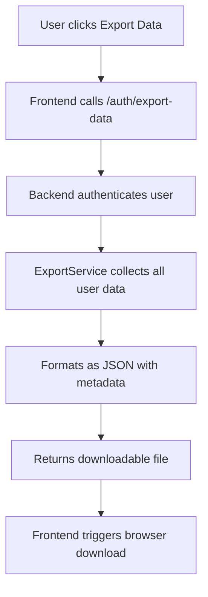

# User Data Export Feature - Implementation Plan

## Overview
Add a "Export My Data" option in the Settings page that allows users to download all their personal data as a JSON file.

## Data Scope
The export will include all data associated with the authenticated user's account:
- **User Profile** - Email, name, phone, date of birth
- **Medicines** - Name, generic name, dosage, form, stock levels, notes
- **Prescriptions** - Doctor info, dates, notes, and linked prescription medicines
- **Reminders** - Time, frequency, dosage, status
- **Reminder Logs** - Historical record of taken/skipped/missed reminders
- **Notifications** - Type, title, message, read status
- **Inventory History** - Stock adjustments and changes

## Architecture



## Implementation Steps

### Phase 1: Backend Implementation

#### 1.1 Create Export Service
**File:** `pillio-backend/app/services/export_service.py`

```python
class ExportService:
    """Service to export all user data in JSON format"""
    
    async def export_user_data(self, user_id: int) -> dict:
        """Export all data for a user"""
        # Collect all data in parallel
        # Return structured JSON with metadata
```

#### 1.2 Add Export Endpoint
**File:** `pillio-backend/app/api/auth.py`

```python
@router.get("/export-data")
async def export_user_data(
    db: AsyncSession = Depends(get_db),
    current_user: User = Depends(get_current_user)
):
    """Export all user data as JSON file"""
    # Call export service
    # Return FileResponse with proper headers
```

### Phase 2: Frontend Implementation

#### 2.1 Add Export API Function
**File:** `src/lib/auth-api.ts`

```typescript
export const authApi = {
  // ... existing methods
  exportData: (): Promise<Blob> =>
    api.get('/auth/export-data', { responseType: 'blob' }),
};
```

#### 2.2 Create Export Button Component
**File:** `src/components/settings/ExportDataButton.tsx`

- Loading state during export
- Error handling with toast notifications
- Download trigger on success

#### 2.3 Update Settings Page
**File:** `src/pages/SettingsPage.tsx`

- Add new card for "Data Management"
- Include Export Data button
- Add "Download My Data" option

## JSON Export Structure

```json
{
  "export_metadata": {
    "export_date": "2025-01-10T12:00:00Z",
    "app_version": "1.0.0",
    "user_email": "user@example.com"
  },
  "user": {
    "id": 1,
    "email": "user@example.com",
    "first_name": "John",
    "last_name": "Doe",
    "phone": "+1234567890",
    "date_of_birth": "1990-01-01",
    "created_at": "2024-01-01T00:00:00Z"
  },
  "medicines": [...],
  "prescriptions": [...],
  "reminders": [...],
  "reminder_logs": [...],
  "notifications": [...],
  "inventory_history": [...]
}
```

## Files to Create/Modify

### New Files
- `pillio-backend/app/services/export_service.py` - Export logic
- `src/components/settings/ExportDataButton.tsx` - Export button component

### Modified Files
- `pillio-backend/app/api/auth.py` - Add export endpoint
- `src/lib/auth-api.ts` - Add exportData function
- `src/pages/SettingsPage.tsx` - Add export section

## Security Considerations
- Only authenticated users can export their own data
- Export endpoint requires valid JWT token
- No sensitive data (password hashes) included in export

## Error Handling
- 401: Unauthorized - redirect to login
- 500: Server error - show error toast
- Network errors - handle gracefully with retry option

## Testing Checklist
- [ ] Export returns valid JSON file
- [ ] File can be downloaded with correct filename
- [ ] All data types are included in export
- [ ] Loading state shows during export
- [ ] Error handling works correctly
- [ ] Logged out users cannot export data
